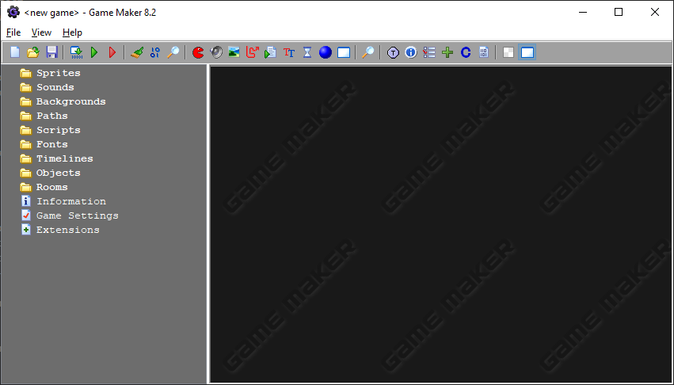
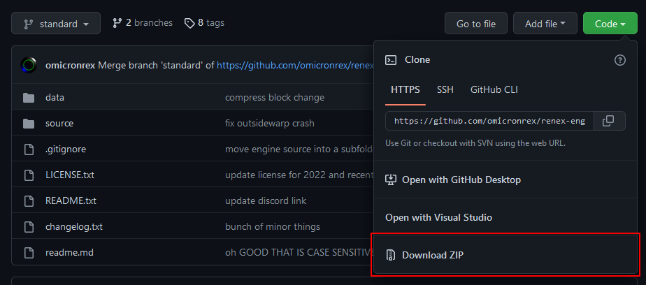

# Setup
To start making a fangame, you'll need to download the right tools. This tutorial uses GameMaker 8.2 and renex engine.

## Getting GameMaker 8.2
GameMaker 8.2 is a community made modification of GameMaker 8.1.
The download link is available in the [gm82 Discord server](https://discord.gg/p7GpvPNUmc), at the top of the #roadmap channel.

When you download the linked game maker 8.2.7z file, extract the entire thing into a folder. In that folder, run install.bat.
This will setup the program's files in a couple places, specifically in `%appdata%\GameMaker8.2` and `%localappdata%\GameMaker8.2`.
It will also leave a shortcut on your desktop, as well as leave some remaining files in the installer folder. These will not be used for anything, you can delete them.

After opening GameMaker 8.2, you should see an empty project screen similar to the screenshot. We won't do anything more in GameMaker just yet.

## Getting renex engine
renex engine is a fangame engine made for GameMaker 8.2. It is what provides you all the fangame essentials, the physics, game systems like saving, etc.
It is downloaded from its [GitHub page](https://github.com/omicronrex/renex-engine). To download the project, find the download ZIP button in the green Code dropdown.

In the downloaded engine folder are 2 more folders - both the source and data folders are important parts to keep, everything else isn't necessary.

renex engine updates often, and as such when starting a new project it is recommended to download the engine again, to guarantee you are up to date. It is harder to help you with any issues you may run into if you are on an outdated version.

## Opening the engine
Your project folder should contain a source folder and a data folder. The data folder contains all files that the stores externally. Without going into what that means, this is where your game's music is stored. The source folder contains everything else, including the GameMaker 8.2 project file - `renex engine.gm82`.

You can open that file, and it should open in GameMaker, or you can open GameMaker, and open the engine from there by pressing File -> Open..., and selecting the same project file.

An opened project at first doesn't look much different from an empty one, you should however see some arrows next to the folders in the left sidebar, indicating those folders contain the game assets.

The next section will start explaining features of the GameMaker software itself, and we will look at features of renex engine later.