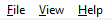
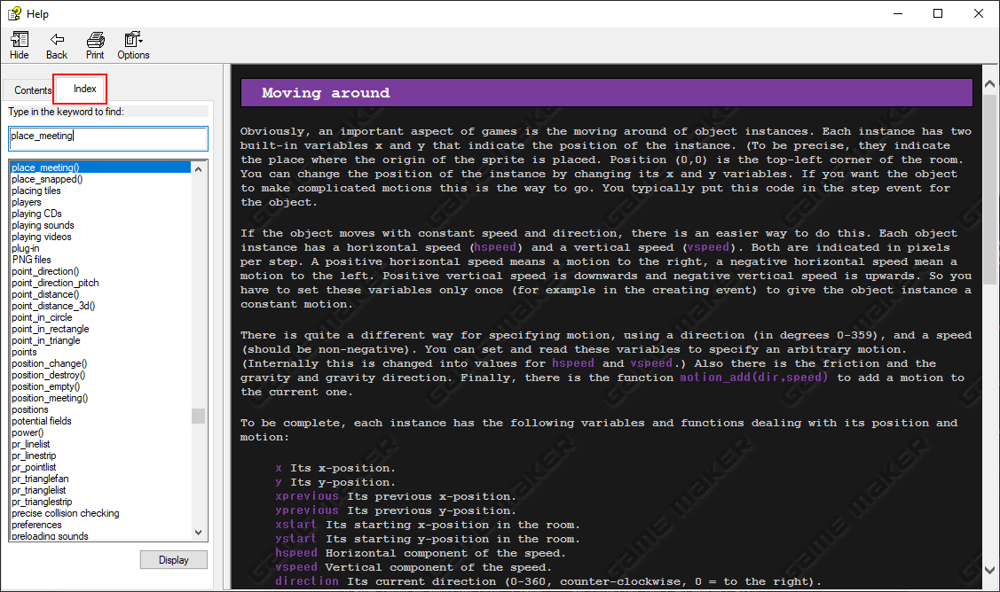
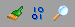

# GameMaker 8.2 Overview

## Menu Bar
`[TODO: what is this is actually called]`

This bar mostly contains rarely needed options. The File dropdown is the most used one, being the place where you save and open projects, or start new ones, though you can also do this with the buttons right below on the top bar.

The View dropdown contains a couple mostly self-explanatory features, none of which see much use, so there's little reason to explain them further.

The Help dropdown contains a button to open the very useful manual, more commonly opened with F1. This manual explains most of how GameMaker works, though it might be hard to find what you need if you don't know what you're looking for.

The Index tab is used to look up specific terms or functions. The manual is generally organized into pages relating to a common topic, and it's an easy way to see what kinds of functions are available to you.

Back to the Help dropdown, the About button contains the release date of your current GameMaker 8.2 version, and can be used to check if you're up to date.

## Top Bar

The top bar contains buttons covering a vast amount of functionality. You can hover over each button to see a tooltip about what it does, as well as their hotkeys if they have one.

The first section contains file options - starting a new project, opening one, or saving the current one.

The next section contains the buttons **necessary to running your game**. The first button is the project export button - This is how you make the final executable file of your game (see the export section later in the guide). The green arrow runs your current project. The red arrow does so as well, but in debug mode. This displays more potentially useful information about your game, but starting off you are unlikely to need it.

The next section contains buttons for some helper features. The first button checks for any assets that share the same name with each other, as this causes issues. The second button checks for any code errors in your projects, but you'll see those either way when you try to run your game.

The third button is the most useful, allowing you to search through all the code in your project. We'll talk about it further once we actually look into GameMaker code.

The next section contains the buttons **necessary to adding new assets to your project**. These are, in order: sprites, sounds, backgrounds, paths, scripts, fonts, time lines, objects, and rooms. We'll talk about each of those later, for now just take note of this as an important part of the top bar.

The next section contains buttons related to your game that aren't assets - GameMaker functionality like triggers (don't confuse these with fangame triggers) and constants. Most notable is the third button, allowing you to access your game settings - these are further explained below.

The last section contains settings added by GameMaker 8.2 `[TODO: is this true about the grid setting]`, most notably the second is a button used to switch between the two available room editors.

## GameMaker Preferences

The GameMaker preferences are accessed from the File dropdown. They're used to customize how you make your game, but they have no effect on how the game actually behaves. You generally don't need to touch those, but there might be some settings that you find more preferable with time and some experimentation.

## Game Settings

The game settings are accessed from either the button on the top bar or the second to last item in the left sidebar. They control various technical behavior of your game. renex engine already comes with its own settings set, and so you shouldn't have much need to modify them further. The most notable exception is the Loading tab which allows you to customize the loading bar shown when you start the game.

## Running the Game

Finally, let's run the game. With renex engine opened, press the green arrow key in the top bar, or press F5 to start the game. You can explore the engine's sample rooms that show off what the engine can do.

Notably, you also have access to debug tools - these help you navigate the game quickly so you can easily get to what you want to test. These include god mode (Home key), infinite jump (End key), saving anywhere (Insert key), showing hitboxes (Delete key), and changing rooms (Page up/down). The debug options can also be accessed with right click, which also offers an autofire option and an easy warp to any room in the project.

By default, the game launches in debug mode when launched from GameMaker, and in regular mode when exported into an executable.

The next section starts explaining GameMaker's most common assets - the various pieces that you game is actually made out of.

Next: [Asset basics](03_asset_basics.md)