# Asset Basics
Assets are various things you can use in your game. 

## Very simplified Basic Assets structure explanation
* Sprites are small images that can have multiple subimages for simple animations and can be used for collision detection.
* Sounds are sounds. You can play them and apply effects to them. 
* Backgrounds are big images that can be used as, well, room backgrounds or tilesets. Also can be used for drawing simple static props (aka decorations)
* Objects are most things in the game. For example, `Player`, `Cherry`, `Warp` - these are all objects. Objects have Sprite, collision mask (also Sprite), events as well as actions (such as executing some code) triggered by those events.
* Rooms contain instances of Objects, some background behind them and tiles. Only one room loaded at a time.

## Asset Tree
Assets are located in the asset tree:

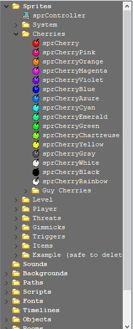

Most assets can be created by right-clicking respective folder -> "Create ..." or by clicking respective button in the top bar:

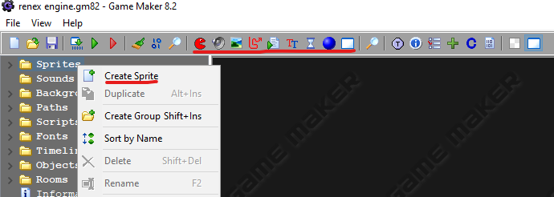

Each asset has a name and can be dragged around in asset tree. You can also group assets in subfolders by right clicking in the tree and selecting "Create group". Order of things in asset browser usually have no impact on other things. If you are not sure, put your assets after those which came with engine.

## Room Editor
Game Maker 8.2 comes with brand new Room Editor, also known as gm82room. It is easier to work with than legacy editor and has support for few very handy features. Here is how it is supposed to look:

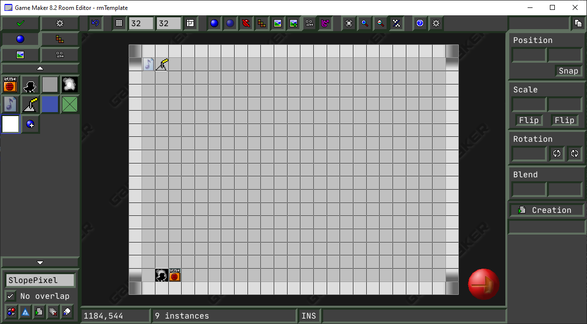

First time you launch the Room Editor you'll get quick guide. 

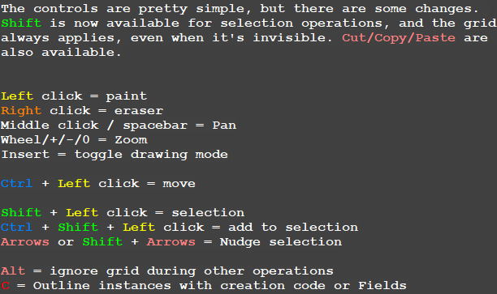

### Creating your first Room

Creating a room is simple. Firstly, in asset browser you Duplicate rmTemplate (You can find it in "Game" folder under "Rooms"). After duplicating you can rename the room however you like and double-click to open.

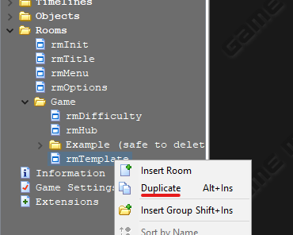

From there you will see a couple of items shown in the left panel, that, you guessed it, you can put in a room. Usually template room also has `Autotiler` object placed near the top-left corner. While it is useful, It is outside of scope of this tutorial to teach how to use it (complicated), so you should just delete it. Instead, open Tiles tab in top-left corner of the window, click on gray bar to select backgroud to choose tiles from, then on button "Add Tiles..." on the panel to add tiles from this background. Select area for a __single__ tile you want to add to your palette, add all tiles you need. Place tiles behind `Block` objects. Feel free to go back to instance tab and add all objects you like (good ol' spikes for example). Remember that you can add more objects to your palette the same way you added tiles. Feel free experimenting with objects, there should not be any hard or complicated stuff with these. If you want to change background for the room, open Background tab, click on gray bar and select background you want. Time to test how things are looking!

Firstly, we need to tell the engine to use our new room as the "start of the game". This might look scary since you'll have to open certain script and edit one line of code in it, but no worries. Open engine_settings script (see the picture) and edit this specific line to use the name of your room instead of whatever there is by default (see the second picture)

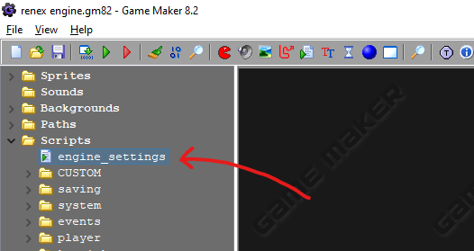
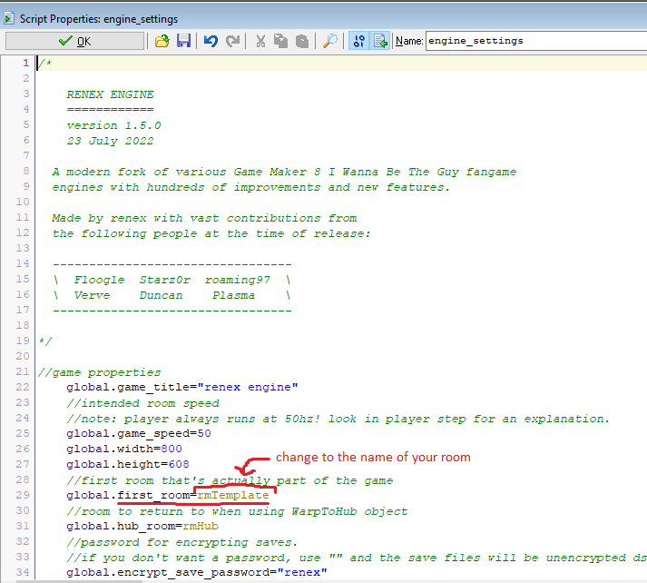

After that is done, you should be able to hit the green "Run test build" button (or just pressing `F5`) and after going through menus you'll see your room in its full glory!

Finally, let's see how to change the music of this room to something else. Assuming you know how to add music to your game (see latter chapters on that). Open your room, find the `MusicPlayer` object in the top-left corner of the room (looks like a piece of paper with a note drawn on it) and click on its bottom-left corner to open it's fields. 

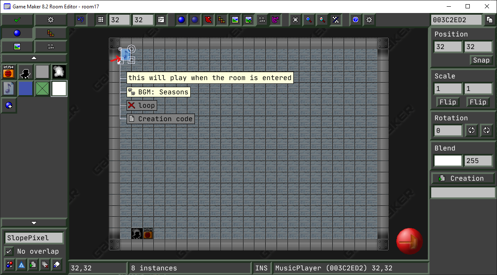

Click on `BGM` option and change to the file name of the song you want to play. That's it! Feel free to launch your game and see the new music being played. 

That's it for the basic tutorial. You can always go around and experiment a little, but it is also recommended to look at other chapters, just so you know is **not recommended** to do.

### Instances
Instances are, basically, instances of certain objects in the room.
It is important to destinguish between Objects and Instances. For example, every red cherry you see in a room is an instance of the object `Cherry`. Instances tab of Room Editor allows you to place instances of selected object from object palette (panel on the left). One of the features of Room Editor is ability for object to define fields, which allow easier configuration of each instance. You access fields by clicking object's bottom-left corner (where the icon is at) 

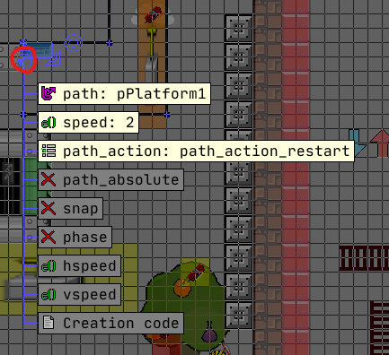

### Grid snap
Grid snap allows you to make objects and tiles get snapped to a grid when placing. 
In the top bar you can find two number input fields. Those control grid snap. One to the left controls grid cell width, one to the right controls grid cell height. As Quick Guide states, you can ignore the snap by pressing `Alt`.

### Tiles
Backgrounds can be used as tilesets. In Tiles tab of Room Editor you can add tiles to palette and place them. Choose background from where to take tiles, then click on "Add tiles..." button, then select the area that matches the single tile you want to add. Repeat until added all tiles needed. Now you can place them down. Alternatively, renex engine provides auto-tiler, but this won't be discussed in this tutorial, you can examine how it works in rTemplate room and examine the code and tile format behind it. 

### Backgrounds
You can have backgrounds in room, up to 8 of them (see in Backgrounds tab of room editor there are 8 buttons from 0 to 7). Each background possibly has a solid Colour and possibly has a Background asset to render above it. You can set it up in Background tab of Room Editor. There are options for drawing it tiled or stretched, also for offset and move speed. Background also can be drawn on foreground layer (above everything else). 

### Room Settings
There are multiple room settings available, but you really should touch only one of them: room size.
Here is a little breakdown of all of them.

* Caption (optional): Room caption is the window title. Engine sets the caption for you to include title and stats, don't edit this option yourself.
* Size: size of the room in pixels.
* Speed: Preferred FPS of the room. Fangames usually run at 50.
* "Persistent" option: If on, when you exit the room it is not completely unloaded, it's state is remembered and gets loaded back when you return. Breaks many things so keep this off.
* "Clear" option: If on, clears the screen before drawing to it. It should stay on. 
* Room code (optional): Custom code to execute when room loads.

## Sprites - animations, origin
Sprite is usually small image that objects use as their appearance. Sprites can have several subimages (frames) in them so you can make simple animations, they can have transparency in them, as well as they can be used for collision detection between objects based on non-transparent pixels (when used by objects as masks). Editing a sprite, you will find several properties as well as the sprite itself. Double-clicking on it will open up individual subimages. Animation is done through setting __instance's__ `image_speed` to the amount of animation to progress each frame (so if the value is 1/5 then each 5 frames it will transition to the next animation subimage). Each sprite also has an origin point. To put simply, when instance uses this sprite, sprite will be placed so the origin point matches with instance's coordinates.

### Creating Sprite
You can create new sprite by either right-clicking on "Sprites" folder in the asset tree -> "Create Sprite" or pressing "Create a sprite" button in top bar (looks like red pacman). Creating sprite or double-clicking existing one in asset tree will open Sprite Properties window:

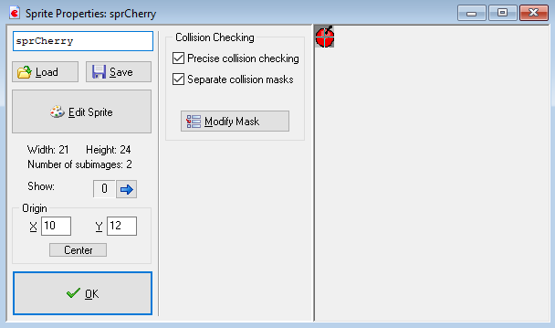

Let's walk through non-obvious options and what each one does:

1) Sprite name: the same name that will appear in the asset tree and by which you can refer to this sprite in code.
2) Load sprite from file: You can load sprites from files! You can use BMP, GIF, JPG and PNG sprites, as well as Game Maker Sprite format.
3) Save sprite into file: You can save sprites into Game Maker Sprite format with all the metadata stored in it. Saving individual subimages is also possible through Sprite Edit window.
4) Edit sprite button: This one will open Edit Sprite window.
5) Sprite origin: This setting sets the point relative to the top left corner of the sprite that will be used as sprite origin point. We've already mentioned what it does.
6) Precise collision checking: If this option is on, the collision with this sprite will be pixel-perfect. Otherwise it'll check only bounding box of the sprite.
7) Separate collision masks: If this option is on and sprite has more than 1 subimage, then collision mask will match the current subimage, instead of using one mask that consists of all subimages grouped on top of eachother. You can edit more of these by pressing "Modify masks" button, but i doubt you'll ever need it.

If you press on "Edit Sprite" button, then it will open Sprite Edit window:

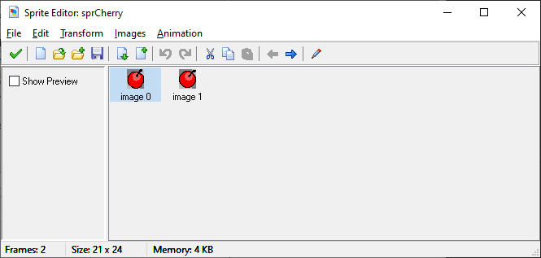

From here you can add, delete or edit each individual subimage of the sprite (double-click to edit), change their order, save one to PNG or read one from file, as well as preview sprite by using "Show preview" checkbox. More image manipulations are available in image editor or in menu options. They should be quite straght-forward to use.

## Backgrounds - tilesets
Backgrounds are images that are simply drawn to the screen. They are used in mainly two ways: Tilesets or Actually room backgrounds. Backgrounds cannot be animated and don't have collision. You can also use backgrounds for various props in your room. Using Background as room background was discussed previously, in order to use it as tileset you should also check the "Use as Tileset" checkbox in Background's properties and set up the size of each tile. Other options are useful only if your tiles are not tightly packed together and have space around them. In order to use background as a static prop, in Room Editor you open Tiles tab, add this background as tile, select whole area as tile region. Now you can place the prop.

### Creating Background
The process is similar to (and even easier than) creating sprites. Right-click on "Backgrounds" folder of Asset Tree or click on "Create Background" button in top bar (looks like an image icon). Creating background or double-clicking existing one will open Background Properties window. From here you can 
* Load background from BMP, GIF, JPG, PNG or Game Maker Background format with all metadata stored in it
* Save background to Game Maker Background format
* Edit background. This will open image editor, from where you also can save background as PNG.

To use background as tileset, tick the checkbox "Use as tile set" and fill in "tile width" and "tile height" options in opened panel.

## Sounds
**!IMPORTANT! This section is important!** 

Sounds in Game Maker 8.2 are slightly different than in other Game Maker versions. They operate on built-in Game Maker 8.2 Sound extension, which allows things like lazy-load sounds, sound encryption, effects, and many other things. But you cannot use the legacy Game Maker Sound system: 

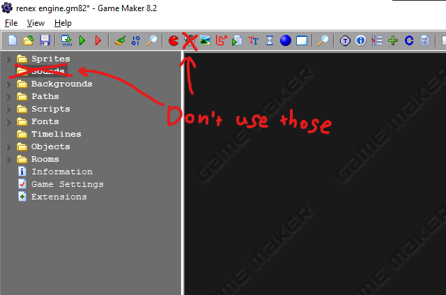

### Adding Sounds
In renex engine you add sounds to your project by putting the sound into respective folder (must have either `.mp3`, `.ogg`, `.wav` for sounds, put them into `data/sounds`, and either `.ogg`, `.mp3`, `.mod`, `.s3m` for music, put them into `data/music`).

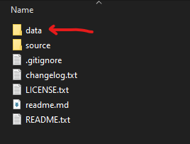

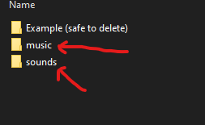

**IMPORTANT**: When you finish with your game and Create Executable, you have to copy the `data` folder together with the exe. Otherwise there will be an error prompting you to do so :-)

To play the sound you use it's file name (WITHOUT file extension). For example, in code:

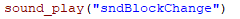

There are plenty of functions to make sounds sound differently, things like pitch, various effects and many more. They are quite advanced but in case you'll need them, there are some info on how to use them: Game Maker 8.2 Sound extension [readme](https://github.com/GM82Project/gm82snd/blob/master/readme.txt)

## Engine Settings
Renex engine is highly customizable, providing you with lots of settings to edit. You can locate them here: 

Those are most important ones:

`game_title` - change the game title displayed in window title.

`first_room` - change the first room player spawns in.

Other options are thoroughly explained in the mentioned file in comments. Make sure to read it if something works not as you want. 