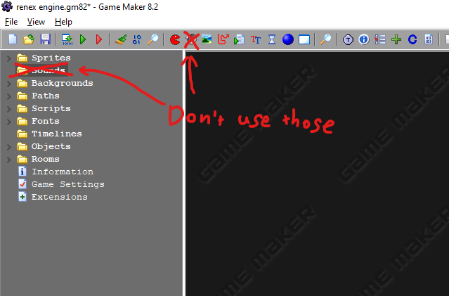

# Asset Basics
Assets are various things you can use in your game. 

## Overview of the most basic GameMaker assets
* Sprites are most of the images in your game. They can be animated, and have an associated collision hitbox.
* Sounds are sounds. These are used by GameMaker's audio engine, which renex engine doesn't use - instead, sound files are stored in the `data` folder, next to the engine `source` folder.
* Backgrounds are big images that can be used as, well, room backgrounds or tilesets.
* Objects are the things that make up your game - they exist somewhere in the current room, and they run their logic. For example, `Player`, `Cherry`, `Warp`, etc. are all objects. The individual things that then exist in your game are called instances of objects, so for example, a room may have many Blocks in it - these are different instances of one object. This is a small distinction, but it's worth noting.
* Rooms are where your game takes place - you are always in one, e.g. starting your game always puts you in the very first room in the Rooms folder. They contain object instances and tiles, and they can have backgrounds.

## Asset Tree
Assets are located in the asset tree:

Most assets can be created by right-clicking the respective folder -> "Create ..." or by clicking the corresponding button in the top bar:

Each asset has a name and can be dragged around in the asset tree. You can also group assets in subfolders by right clicking in the tree and selecting "Create group".

## Room Editor
GameMaker 8.2 comes with two room editors - the classic GameMaker 8 editor, and a new one made for 8.2, commonly referred to as gm82room. You can switch between the two editors in the far right button on the top button bar, in the File dropdown, or in GameMaker preferences. You probably won't find yourself needing to use the legacy editor, so we'll only focus on the new one.

gm82room opens in a separate window, as it is a separate program - there isn't a way to edit your project at the same time as you are editing a room. Simply double click any room in the asset tree to open it, here we'll open `rmTemplate` in the `Game` folder.

The first time you launch the room editor you'll get a quick guide.

### Creating your first Room

Creating a room is simple. Because there are common room settings and objects between most rooms, we don't actually create a brand new room. Instead, make a duplicate of `rmTemplate` by right-clicking the room in the asset tree.

After making the new room, you can rename it however you like and double-click it to open.

The editor has several "modes", selected by the big buttons in the top left corner - you can see the editor opens in the Instances mode. This is where you place and move instances of objects. On the left you have a palette of objects to choose from - these are all objects that already exist in the room. The very last button in the palette is used to select other objects in the project.

You can try dragging some objects around, or stretching some of the Blocks with the square handle at the bottom left of the selected instance.

Some of the objects already present in the template room are `PlayerStart`, which indicates where the Player spawns, the savepoint, a `MusicPlayer` instance that sets the background music for this room, or an `Autotiler` that places tiles in the room to match the Blocks when the room is created. To explain the difference between instances and tiles, we'll place the tiles ourselves, so for now delete the `Autotiler` instance.

Switch to the Tiles tab in the top left corner, and click on the empty gray bar to select a tileset. Click the plus button in the left palette tab to add a new tile. Select a single tile to place (you can drag to select a bigger area, but you most likely don't need to), and press the finish button in the top left. Now you can select that tile from the palette at any point and place it in the room, moving and stretching it just like you can with instances. Place tiles under all of the Blocks in the room - the Blocks won't actually be visible in-game!

Lastly for now, you can switch to the backgrounds tab, and select a background by clicking the empty gray box below the 8 numbered buttons, just like you selected a tileset.

Now we need to tell the engine to use our new room as the start of the game. This might look scary since you'll have to open certain script and edit one line of code in it, but no worries. Open the engine_settings script at the very top of the Scripts folder.

Now edit this specific line so that `global.first_room` gets set to the new room you just made.

After that is done, you should be able to hit the green "Run test build" button (or just press `F5`) and after going through the menus you'll see your room in its full glory!

Finally, let's change the background music played in this room. It is controlled by `MusicPlayer` object, which you may find in the top-left corner of room. You can click on bottom-left corner of the object to edit its fields. 

Game music is stored in the data folder next to the engine source folder. We'll go into adding your own music later, for now just use one of the example tracks, like `barnicle`. Change the field so it looks like this - notice how the file extension isn't included in the file name:

Feel free to launch your game and see the new music in action.

That concludes the basic room tutorial. You can always go around and experiment, but it is also recommended to look at other chapters for general knowledge.

## Editor modes
Now that we've used most parts of the editor a little bit, we'll go over everything again in more detail before moving on to the rest of Game Maker.

### Instances
The instances tab is where you place instances of objects in your room. Instances run nearly all logic in your game. They are selected in the object palette on the left, using the plus button at the end too add more to the palette from the project.

Instances can be stretched and rotated, and the editor provides features for group selection and manipulation - check the F1 help menu. Objects can also have "fields" - these allow simple configuration of an instance's behavior, where you would have otherwise worked with more complicated code. Fields are accessed with the bottom left icon of a selected instance:

### Grid snap
Grid snap keeps all your instances and tiles aligned to a grid when placing or resizing. The size of this grid is controlled by the two text fields in the top bar of the editor. Blocks are most commonly 32px in size, so it makes sense to keep the grid relative to that.

To adjust independently of the grid, you can either hold `Alt` when moving or rotating, or you can use the arrow keys to nudge an instance by a single pixel.

### Tiles
Tiles are, unlike instances, almost purely visual. You first select a tileset, then add tiles to the tile palette. Tiles are placed on tile layers - these are selected or added in the right panel of the editor.

Instead of placing tiles manually, you could use the `AutoTiler` object - we will talk about setting it up later.

### Backgrounds
In the Backgrounds tab you can set up to 8 room backgrounds.You may also simply set a solid color as the basckground to the room. Backgrounds can be drawn tiled or stretched to fill the room, they can be static or moving, and they can be in the back or in the front.

### Room Settings
There are multiple room settings available, but you really shouldn't need to touch anything other than the room size. 
Here is a little breakdown of all of them.

* Caption (optional): Sets the title of your game window. However, the engine sets the caption for you already, so there's no reason to change this.
* Size: size of the room in pixels - the default screen size is 800x608, and it's common to make all rooms some multiple of that amount. At the very least you should keep your sizes a multiple of 32 so no block gets cut in half.
* Speed: Preferred FPS of the room. Just like the window title, the engine sets the framerate regardless of this option.
* Persistent: If on, the room doesn't reset when you leave it. This often breaks if it's not specifically designed for, don't use this option unless you know what you are doing.
* Clear: Technical setting that clears the screen game window every frame. You don't need to touch this.
* Room code: Custom code to execute every time the room loads.

## Assets
Now that we know how rooms make up a game, let's go over some of the more  important assets so we can start making more interesting changes and additions.

## Sprites - animations, origin
Sprites are most of the images in your game. Most commonly, objects are assigned sprites - e.g. the `Cherry` object uses the `sprCherry` sprite.

Sprites can have several subimages (frames) making them play an animation. This animation by default plays at a speed of 1 sprite frame per game frame - its speed is changed on an instance by instance basis, by modifying the `image_speed` variable - something we'll talk about when we get into code.

Each sprite has an origin point - when a sprite is drawn on a certain coordinate, the origin defines how it's drawn relative to that point. This is also the point around which sprites get flipped, e.g. when the player turns left and right.

Finally, sprites carry their own collision data, usually referred to as the collision mask. A sprite can be used as an instance's mask, meaning it's used only as a collision hitbox and not actually visible.

### Sprite Properties
Creating a sprite or double-clicking an existing one in the asset tree will bring up the Sprite Properties window:

* The precise collision checking checkbox sets whether the collision is pixel-perfect, or just rounded to a rectangle around the sprite. You can see a preview of the mask shape in the Modify Mask window.
* The separate collision masks checkbox sets whether the collision uses a different hitbox for each frame of animation, or whether all frames get merged into one mask.
* The Modify Mask window allows you to set how the collision mask gets made for the sprite - you can choose between different shapes, or whether transparent pixels are included in the mask.

The Edit Sprite button opens the sprite editor:

Here you can add, edit or delete individual subimages of the sprite, change their order, add them from a file, as well as preview the sprite animation with the "Show preview" checkbox. You can open each frame to edit it with a simple image editor, or use the effects in the top menu of the window.

## Backgrounds / tilesets
Backgrounds are images that can used as either room backgrounds or tilesets. They are similar to Sprites, and are added similarly, but are simpler in that they can't be animated. You can mark a background to be used as a tileset in its properties by checking the "Use as Tileset" checkbox and setting up the tile splitting.

## Sounds (Important)
Sounds in renex engine are slightly different than in other Game Maker versions. renex engine uses a newer and more robust sound engine that does not use the Game Maker sound assets. This is why the Sounds folder in your project is empty.

### Adding Sounds
In renex engine sound effects and music are stored in a separate data folder, with each separated in one of two folders:
* sounds: `data/sounds` - allowed file extensions: `.mp3`, `.ogg`, `.wav`
* music: `data/music` - allowed file extensions `.ogg`, `.mp3`, `.mod`, `.s3m`

**IMPORTANT**: When you export your game, you will have to copy the `data` folder together with the game exe. Otherwise there will be an error prompting you to do so :-)

The most notable difference with the new sound system is that sounds and music are referred to by their file name in a string. Where in other engines you would use something like `musBarnicle`, having that be a sound asset in your project, in renex engine you use `"barnicle"`, referring to `barnicle.mod` in the music folder. 

## Engine Settings
renex engine is highly customizable, providing you with lots of settings to edit. They are located in the `engine_settings` script: 

These are settings that modify various behavior of your game. We've already touched one setting when creating our first room in the first half of this chapter, by changing the `first_room` setting. The settings all come with comments explaining what they do. For your first game you probably only need to edit a couple:

- `game_title` - the name of the game displayed in the window title.
- `first_room` - the first room that the game starts in.